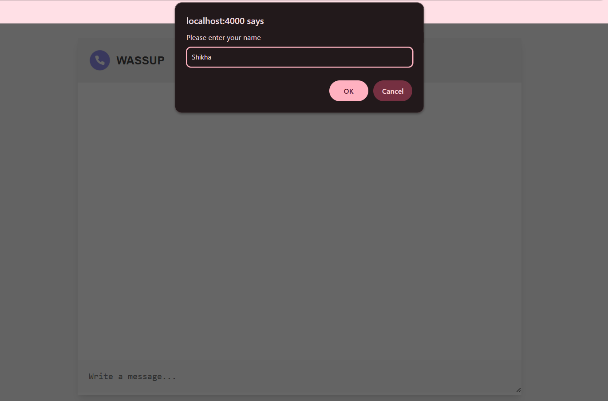
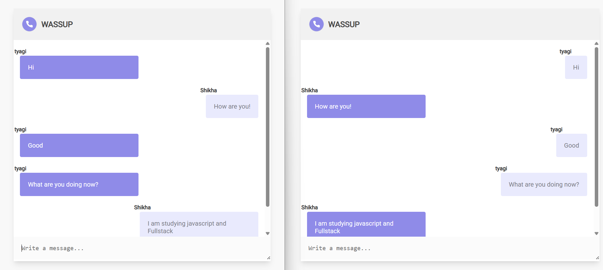

---

# README.md

````markdown
# Wassup Chat App 💬




## Overview

**Wassup Chat App** is a real-time, simple, and lightweight chat application built with **Node.js**, **Express**, and **Socket.IO**.  
It allows multiple users to connect, send messages instantly, and see messages from others in real-time — no page reload needed!

This app is perfect for learning how to create real-time applications using WebSockets and serves as a great foundation for more advanced chat systems.

---

## Features

- Real-time messaging with Socket.IO
- Multi-user support with username prompts
- Clean, responsive UI with modern styling
- Message differentiation for outgoing and incoming chats
- Easy to extend for rooms, private messages, or other features

---

## Demo

  
*(Add a demo GIF or screenshot here to showcase the app)*

---

## Tech Stack

- **Node.js**: JavaScript runtime environment
- **Express.js**: Fast, minimalist web framework for Node.js
- **Socket.IO**: Real-time bidirectional event-based communication
- **HTML/CSS/JS**: Frontend UI with vanilla JavaScript
- **Google Fonts (Roboto)**: Clean typography

---

## Installation & Setup

1. **Clone the repository**

```bash
git clone https://github.com/yourusername/wassup-chat-app.git
cd wassup-chat-app
````

2. **Install dependencies**

```bash
npm install
```

3. **Run the server**

```bash
npm start
```

4. **Open your browser**

Go to [http://localhost:4000](http://localhost:4000) and start chatting!

---

## Project Structure

```
wassup-chat-app/
│
├── public/
│   ├── index.html        # Frontend HTML page
│   ├── client.js         # Frontend Socket.IO logic
│   ├── style.css         # CSS styling
│   └── wassup.png        # Logo image
│
├── server.js             # Backend Express + Socket.IO server
├── package.json          # Project metadata & dependencies
└── README.md             # This file
```

---

## How It Works

* The server hosts a static frontend and establishes a Socket.IO connection.
* On client connection, users enter their name.
* Messages typed are sent to the server via Socket.IO.
* The server broadcasts incoming messages to all other clients.
* Messages are displayed differently based on whether they are sent by the user (outgoing) or received (incoming).

---

## Customization Ideas

* Add chat rooms or private messaging
* Store chat history in a database (MongoDB, Redis, etc.)
* Add typing indicators ("User is typing...")
* Improve UI with animations or themes
* Add user authentication and profiles

---

## Troubleshooting

* **Port already in use?**
  Change the port in `server.js` or free the port.

* **Socket.IO client not connecting?**
  Ensure your frontend is loading `/socket.io/socket.io.js` correctly.

* **Styling broken?**
  Check if `style.css` is correctly linked and loaded.

---

## Contribution

Feel free to open issues or submit pull requests!
Please keep the code clean and add meaningful comments.

---

## License

This project is open source and available under the **MIT License**.

---

## Author

**Shikha Tyagi**
[GitHub Profile](https://github.com/developershikhatyagi) | [LinkedIn](https://linkedin.com/in/shikhatyagi)

---

Thank you for checking out **Wassup Chat App**! 🚀
Happy chatting! 🎉

```


